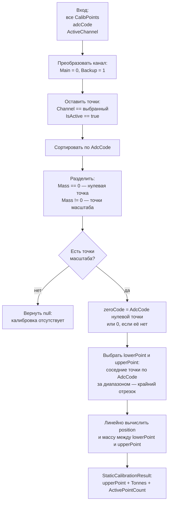
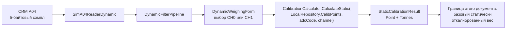

# Поток статических калибровочных точек

Документ фиксирует текущую реализацию получения статических калибровочных точек
из PostgreSQL и преобразования кода АЦП в тонны.

Поправочные коэффициенты направлений и их применение здесь намеренно не
рассматриваются. Для динамического режима схема заканчивается на результате
статической калибровки.

## Где выполняется работа

| Ответственность | Класс или файл |
| --- | --- |
| Запуск загрузки калибровки | [Program.cs](../Program.cs#L65) |
| Чтение точек из PostgreSQL и хранение снимка в памяти | [LocalRepository](../Services/Repositories/LocalRepository.cs#L13) |
| Резервный снимок точек в `settings.json` | [SettingsService](../Services/Configuration/SettingsService.cs#L106), [AppSettings](../Services/Configuration/AppSettings.cs#L20) |
| Модель одной точки | [CalibPoint](../Models/CalibPoint.cs#L3) |
| Выбор точки и вычисление массы | [CalibrationCalculator](../Application/CalibrationCalculator.cs#L16) |
| Результат вычисления вместе с выбранной точкой | [StaticCalibrationResult](../Models/StaticCalibrationResult.cs#L3) |
| Создание, просмотр и сохранение точек | [ServiceForm](../Forms/ServiceForm.cs#L1590) |
| Применение в статическом взвешивании | [StaticWeighingForm](../Forms/StaticWeighingForm.cs#L48) |
| Применение статических точек в динамическом потоке | [DynamicWeighingForm](../Forms/DynamicWeighingForm.cs#L64) |
| Схема таблицы PostgreSQL | [scale_db.sql](../install/database/scale_db.sql#L47) |

Расчёт должен быть сосредоточен в `CalibrationCalculator`. Формы передают ему
только снимок точек, текущий код АЦП и выбранный канал.

## Загрузка точек при запуске

```mermaid
flowchart TD
    DB[(PostgreSQL<br/>calibration_points)]
    SQL["LocalRepository.LoadCalibrationFromDbAsync()<br/>SELECT всех строк<br/>ORDER BY channel, adc_code"]
    MEM["LocalRepository.CalibPoints<br/>IReadOnlyList&lt;CalibPoint&gt;<br/>снимок в памяти"]
    SETTINGS["settings.json<br/>CachedStaticPoints"]
    START["Program.Main()"]
    OK{"Чтение БД<br/>успешно?"}
    MAIN["MainForm получает один<br/>экземпляр LocalRepository"]
    FORMS["StaticWeighingForm<br/>DynamicWeighingForm<br/>ServiceForm"]

    START --> SQL
    DB --> SQL
    SQL --> OK
    OK -- да --> MEM
    MEM -->|"UpdateCalibrationCache() + Save()"| SETTINGS
    OK -- нет -->|"RestoreLastKnownCalibration()"| SETTINGS
    SETTINGS -->|"копия точек"| MEM
    MEM --> MAIN
    MAIN --> FORMS
```

При успешном старте `LocalRepository` читает все строки
`calibration_points`, включая неактивную историю. Отбор рабочего канала и
активных точек выполняется позднее в `CalibrationCalculator`.

При ошибке чтения БД используется последний снимок `CachedStaticPoints` из
`settings.json`. Если снимок пуст, формы считают калибровку отсутствующей и
не разрешают взвешивание.

## Алгоритм CalibrationCalculator



Для двух и более ненулевых точек используются точки `lowerPoint` (меньший
`AdcCode`) и `upperPoint` (больший `AdcCode`). Их названия относятся только
к порядку на шкале кодов, а не к направлению движения поезда. Нулевая точка
задаёт смещение `zeroCode` и не является точкой масштаба.

```text
lowerCode = lowerPoint.AdcCode - zeroCode
upperCode = upperPoint.AdcCode - zeroCode
position = (adcCode - zeroCode - lowerCode) / (upperCode - lowerCode)
tonnes = lowerPoint.Mass + position * (upperPoint.Mass - lowerPoint.Mass)
```

Ниже первой и выше последней точки используется крайний отрезок
(линейная экстраполяция). Если есть только одна ненулевая точка, сохраняется
расчёт через её `CalibrationValue`. Поправка направления в этом алгоритме не
участвует и применяется отдельно после получения статического веса.

## Путь статического взвешивания

```mermaid
flowchart LR
    ADC["СИМ А04<br/>4-байтовый кадр"]
    READER["SimA04ReaderStatic"]
    FILTER["StaticFilterPipeline"]
    FORM["StaticWeighingForm<br/>выбор CH0 или CH1"]
    CALC["CalibrationCalculator.CalculateStatic(<br/>LocalRepository.CalibPoints,<br/>adcCode, channel)"]
    RAW["StaticCalibrationResult.Tonnes"]
    ZERO["Вычесть операторский<br/>zeroOffsetTonnes"]
    ROUND["WeightFormatter<br/>округление по дискретности"]
    WAGON["Вес тележки<br/>+ ID выбранной точки"]
    SAVE["LocalRepository.SaveWagonAsync()<br/>wagon_weighing"]

    ADC --> READER --> FILTER --> FORM --> CALC --> RAW --> ZERO --> ROUND --> WAGON --> SAVE
```



Для первой тележки форма запоминает код и ID выбранной точки. При второй
тележке обе массы вычисляются повторно, после чего в `wagon_weighing`
сохраняются `bogie1_calibration_point_id` и
`bogie2_calibration_point_id`.

## Путь динамического потока до статической калибровки



На этом этапе динамический и статический режимы используют один и тот же
`CalibrationCalculator` и один снимок `LocalRepository.CalibPoints`.

## Как создаётся CalibrationValue

На вкладке `Калибровка Статика` оператор захватывает код АЦП и вводит массу.
Для новой ненулевой точки `ServiceForm` рассчитывает:

```text
scaleCode = adcCode - zeroCode
calibrationValue = mass / scaleCode * 65535
```

Результат округляется до трёх знаков от нуля. `CalibrationValue` используется текущим алгоритмом только если в канале
есть одна ненулевая точка. При нескольких точках расчёт выполняется по
линейному отрезку между их массами и ADC-кодами (см. раздел выше).

После сохранения `LocalRepository.SaveCalibPointsAsync()`:

1. существующие точки не изменяются;
2. прежнюю точку можно только сделать неактивной;
3. новые активные точки вставляются отдельными строками;
4. `LocalRepository.CalibPoints` перечитывается из БД;
5. обновлённый снимок записывается в `settings.json`.

## Тестовый контур линейной интерполяции

В `ScaleListener` кнопка `Проверка калибровки` открывает отдельную WinForms-форму. В левой таблице задаются точки (масса и ADC-код), после чего `Выполнить тест` сравнивает результат текущего `CalibrationCalculator.CalculateStatic` с независимым кусочно-линейным эталоном. В результатах видны ожидаемая масса, фактическая масса, ошибка и выбранная точка алгоритма.

Кнопка `Экспорт CSV` сохраняет снимок «до» для последующего сравнения после изменения алгоритма. Выбор строки и `Connect` позволяют подать выбранный ADC-код в эмулятор СИМ А04 по COM4; канал выбирается в форме. Направочные коэффициенты в этот контур не входят.
